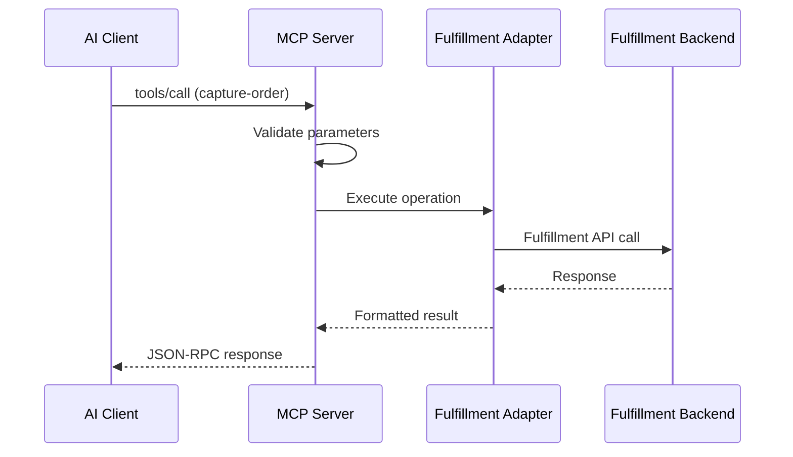

# Universal Fulfillment System MCP Server Specification

**Version:** 1.0.0
**Status:** Draft
**Last Updated:** August 2025

## Table of Contents

1. [Introduction](#introduction)
2. [Protocol Requirements](#protocol-requirements)
3. [Transport Mechanism](#transport-mechanism)
4. [Server Capabilities](#server-capabilities)
5. [Tool Specifications](#tool-specifications)
6. [Error Handling](#error-handling)
7. [Versioning Strategy](#versioning-strategy)
8. [Security Considerations](#security-considerations)
9. [Performance Requirements](#performance-requirements)
10. [Extension Model](#extension-model)

---

## Introduction

### Purpose

The Universal Fulfillment System (Fulfillment) MCP Server provides a standardized interface between AI agents and fulfillment systems. This specification defines the server implementation requirements, protocol details, and operational characteristics necessary for compliant implementations.

### Scope

This specification covers:
- MCP protocol implementation for Fulfillment operations
- Standard tool definitions for order lifecycle management
- Error handling and recovery procedures
- Extension mechanisms for custom implementations
- Performance and security requirements

### Terminology

- **MCP**: Model Context Protocol - The communication protocol between AI agents and external systems
- **Tool**: A callable function exposed by the MCP server that performs a specific operation
- **Transport**: The communication channel used for MCP messages (stdio, HTTP, WebSocket)
- **Adapter**: The interface layer between the MCP server and the actual Fulfillment backend

---

## Protocol Requirements

### MCP Version Compliance

The server MUST implement MCP Protocol version 0.1.0 or higher, supporting:

- JSON-RPC 2.0 message format
- Request/response pattern
- Batch requests (optional)
- Notifications (optional)

### Message Format

All messages MUST conform to the JSON-RPC 2.0 specification:

```json
{
  "jsonrpc": "2.0",
  "method": "tools/call",
  "params": {
    "name": "capture-order",
    "arguments": {
      "order": {
        "extOrderId": "ORD-2024-001",
        "customer": {...},
        "items": [...]
      }
    }
  },
  "id": "req-123"
}
```

### Required Protocol Methods

The server MUST implement these MCP protocol methods:

1. **initialize**
   - Establishes connection and exchanges capabilities
   - Returns server information and supported features

2. **tools/list**
   - Returns available tools with schemas
   - Includes tool descriptions for AI assistants

3. **tools/call**
   - Executes a specific tool with provided arguments
   - Returns tool results or error responses

4. **ping**
   - Health check mechanism
   - Returns pong response

### Optional Protocol Methods

The server MAY implement:

1. **resources/list**
   - Expose data resources (order lists, inventory status)

2. **prompts/list**
   - Provide prompt templates for common operations

3. **sampling/create**
   - Support for completion assistance

---

## Transport Mechanism

### Primary Transport: stdio

The server MUST support stdio (standard input/output) as the primary transport mechanism:

```typescript
interface StdioTransport {
  input: process.stdin;   // Read JSON-RPC messages
  output: process.stdout;  // Write JSON-RPC responses
  errors: process.stderr;  // Log errors and diagnostics
}
```

#### Message Framing

- Messages are newline-delimited JSON (`\n`)
- Each line contains a complete JSON-RPC message
- Maximum message size: 10MB (configurable)

#### Example stdio flow:

```bash
# Server launch
$ cof-mcp

# Client sends (stdin):
{"jsonrpc":"2.0","method":"initialize","params":{"clientInfo":{"name":"claude"}},"id":1}

# Server responds (stdout):
{"jsonrpc":"2.0","result":{"serverInfo":{"name":"cof-mcp","version":"1.0.0"}},"id":1}
```

### Optional Transports

Implementations MAY support additional transports:
#### Streamable HTTP Transport
```yaml
endpoint: http://localhost:3000/mcp
method: POST
content-type: application/json
authentication: Bearer token or API key
```

#### WebSocket Transport
```yaml
endpoint: ws://localhost:3001/mcp
protocol: mcp.v1
authentication: Connection-time auth
```

---

## Server Capabilities

### Capability Matrix

The server MUST declare its capabilities during initialization:

| Capability         | Required      | Description                                |
| ------------------ | ------------- | ------------------------------------------ |
| tools              | ✅ Yes         | Supports tool execution                    |
| tools.descriptions | ✅ Yes         | Provides AI-friendly descriptions          |
| tools.schemas      | ✅ Yes         | Includes JSON Schema definitions           |
| resources          | ❌ No          | Exposes data resources                     |
| prompts            | ❌ No          | Provides prompt templates                  |
| sampling           | ❌ No          | Supports completion assistance             |
| logging            | ⚠️ Recommended | Structured logging support                 |
| progress           | ❌ No          | Progress notifications for long operations |

### Server Information

The server MUST provide:

```typescript
interface ServerInfo {
  name: "cof-mcp";
  version: string;          // Semantic version
  protocolVersion: "0.1.0"; // MCP protocol version
  capabilities: Capabilities;
  vendor?: {
    name: string;
    url?: string;
    contact?: string;
  };
}
```

### Tool Registry

The server MUST maintain a registry of available tools:

```typescript
interface ToolRegistry {
  tools: Map<string, Tool>;

  register(tool: Tool): void;
  get(name: string): Tool | undefined;
  list(): Tool[];
  validate(name: string, params: any): ValidationResult;
}
```

---

## Tool Specifications

### Standard Tool Set

The server MUST implement these 15 standard tools:

#### Order Actions (6 tools)
1. **capture-order** - Create new orders
2. **cancel-order** - Cancel existing orders
3. **update-order** - Modify order details
4. **return-order** - Process returns
5. **exchange-order** - Handle exchanges
6. **ship-order** - Mark orders as shipped

#### Management Tools (3 tools)
7. **hold-order** - Place orders on hold
8. **split-order** - Split into multiple shipments
9. **reserve-inventory** - Reserve stock

#### Query Tools (6 tools)
10. **get-order** - Retrieve order details
11. **get-inventory** - Check stock levels
12. **get-product** - Get product information
13. **get-customer** - Retrieve customer data
14. **get-shipment** - Track shipments
15. **get-buyer** - Get B2B buyer information

### Tool Definition Structure

Each tool MUST provide:

```typescript
interface ToolDefinition {
  name: string;              // Unique identifier (kebab-case)
  description: string;       // AI-friendly description
  inputSchema: JSONSchema;   // JSON Schema for parameters
  outputSchema: JSONSchema;  // JSON Schema for response
  errors: ErrorDefinition[]; // Possible error conditions
  examples?: Example[];      // Usage examples
  metadata?: {
    category: "action" | "management" | "query";
    async?: boolean;       // Long-running operation
    idempotent?: boolean;  // Safe to retry
    requiresAuth?: boolean;
  };
}
```

### Tool Execution Flow



---

## Error Handling

For canonical codes, categories, and retryability guidance used across the implementation, see: [Error Model](../standard/error-model.md).

### Error Response Format

All errors MUST follow JSON-RPC 2.0 error format:

```json
{
  "jsonrpc": "2.0",
  "error": {
    "code": -32602,
    "message": "Invalid params",
    "data": {
      "field": "order.customer.email",
      "reason": "Invalid email format",
      "value": "not-an-email"
    }
  },
  "id": "req-123"
}
```

### Standard Error Codes

#### JSON-RPC Standard Codes
| Code   | Name             | Description         |
| ------ | ---------------- | ------------------- |
| -32700 | Parse error      | Invalid JSON        |
| -32600 | Invalid request  | Not a valid request |
| -32601 | Method not found | Unknown method      |
| -32602 | Invalid params   | Invalid parameters  |
| -32603 | Internal error   | Server error        |

#### Fulfillment-Specific Error Codes
| Code | Name                   | Description               | Retryable |
| ---- | ---------------------- | ------------------------- | --------- |
| 2001 | VALIDATION_ERROR       | Input validation failed   | No        |
| 2002 | MISSING_REQUIRED_FIELD | Required field missing    | No        |
| 2003 | INVALID_FORMAT         | Field format incorrect    | No        |
| 3001 | RATE_LIMIT_EXCEEDED    | Too many requests         | Yes       |
| 3002 | TIMEOUT                | Operation timed out       | Yes       |
| 4001 | ADAPTER_ERROR          | Backend integration error | Yes       |
| 4002 | BACKEND_UNAVAILABLE    | Fulfillment system down   | Yes       |
| 5001 | NOT_IMPLEMENTED        | Feature not available     | No        |

Business-domain error codes (for example `ORDER_NOT_FOUND`, `INSUFFICIENT_INVENTORY`) are defined by each adapter via `AdapterError` and relayed in the `FulfillmentError` payload as `data.originalError`.

### Error Recovery Strategy

```typescript
interface ErrorRecovery {
  isRetryable(): boolean;
  maxRetries: number;
  retryDelay: number; // milliseconds
  backoffMultiplier: number;

  handleError(error: Error): ErrorResponse {
    if (this.isRetryable() && this.attemptCount < this.maxRetries) {
      return this.scheduleRetry();
    }
    return this.failPermanently();
  }
}
```

---

## Versioning Strategy

### Semantic Versioning

The server MUST use semantic versioning (MAJOR.MINOR.PATCH):

- **MAJOR**: Breaking changes to tool signatures or behavior
- **MINOR**: New tools or optional features added
- **PATCH**: Bug fixes and performance improvements

### Version Negotiation

During initialization, client and server negotiate compatible version:

```json
{
  "method": "initialize",
  "params": {
    "protocolVersion": "0.1.0",
    "clientInfo": {
      "name": "claude",
      "version": "2024.1"
    }
  }
}
```

Server response indicates supported version:

```json
{
  "result": {
    "protocolVersion": "0.1.0",
    "serverInfo": {
      "name": "cof-mcp",
      "version": "1.0.0"
    }
  }
}
```

### Backward Compatibility

- Servers MUST maintain backward compatibility within MAJOR versions
- New optional parameters MAY be added to existing tools
- Tool removal requires MAJOR version increment
- Deprecated features MUST be marked and maintained for one MAJOR version

---

## Security Considerations

### Authentication

Implementations SHOULD support authentication mechanisms:

```typescript
interface Authentication {
  type: "none" | "api-key" | "oauth2" | "custom";

  validateRequest(request: Request): boolean;
  refreshToken?(): Promise<string>;
}
```

### Authorization

Fine-grained permissions for tool access:

```typescript
interface Authorization {
  canExecuteTool(user: User, tool: string): boolean;
  canAccessOrder(user: User, orderId: string): boolean;
  getRateLimits(user: User): RateLimits;
}
```

### Data Protection

- Sensitive data (PII, payment info) MUST be redacted in logs
- Responses SHOULD minimize data exposure
- Support field-level encryption for sensitive attributes

### Rate Limiting

Protect against abuse:

```typescript
interface RateLimits {
  requestsPerMinute: number;
  requestsPerHour: number;
  burstLimit: number;

  toolLimits?: Map<string, {
    requestsPerMinute: number;
  }>;
}
```

---

## Performance Requirements

### Response Time Targets

| Operation Type  | Target  | Maximum |
| --------------- | ------- | ------- |
| Query tools     | < 100ms | 1s      |
| Action tools    | < 500ms | 5s      |
| Bulk operations | < 2s    | 30s     |
| Initialization  | < 200ms | 2s      |

### Concurrency

- Support minimum 10 concurrent requests
- Implement request queuing for overload protection
- Use connection pooling for backend integrations

### Resource Limits

```yaml
memory:
  max_heap: 512MB
  max_message_size: 10MB
  max_response_size: 10MB

connections:
  max_concurrent: 100
  timeout: 30s
  keepalive: true

caching:
  ttl: 300s  # 5 minutes
  max_entries: 1000
```

---

## Extension Model

### Adapter Loading Mechanisms

The server supports **three distinct adapter loading mechanisms** to accommodate various deployment scenarios:

#### 1. Built-in Adapters
Adapters that ship with the core server package:
- Always available without additional installation
- Currently includes the mock adapter for testing
- Loaded synchronously at server startup

#### 2. NPM Package Adapters
Adapters published to npm registry (public or private):
- Installed via `npm install @vendor/adapter-name`
- Dynamically imported at runtime
- Ideal for Fulfillment vendors distributing adapters
- Supports versioning and dependency management

#### 3. Local File Adapters
Adapters loaded from filesystem paths:
- No publication or registry required
- Loaded via relative or absolute paths
- Perfect for private retailer implementations
- Maintains complete code privacy

### Adapter Configuration Schema

```typescript
interface AdapterConfig {
  type: 'built-in' | 'npm' | 'local';

  // For built-in adapters
  name?: string;           // e.g., 'mock'

  // For NPM adapters
  package?: string;        // e.g., '@pipe17/cof-fulfillment-adapter'

  // For local adapters
  path?: string;           // e.g., '../my-adapter/dist'

  // Optional for all types$$
  exportName?: string;     // Export to use if not 'default'
  options?: Record<string, any>;  // Adapter-specific options
}
```

### Environment Configuration

```bash
# Built-in Adapter
ADAPTER_TYPE=built-in
ADAPTER_NAME=mock

# NPM Package Adapter
ADAPTER_TYPE=npm
ADAPTER_PACKAGE=@vendor/cof-fulfillment-adapter-vendor

# Local File Adapter
ADAPTER_TYPE=local
ADAPTER_PATH=../my-private-adapter

# Adapter Options (works with all types)
ADAPTER_OPTIONS_API_KEY=secret-key
ADAPTER_OPTIONS_API_URL=https://api.example.com
```

### Custom Tool Registration

Implementations MAY add custom tools beyond the standard 15:

```typescript
interface CustomTool extends Tool {
  namespace: string;  // Vendor namespace
  experimental?: boolean;

  register(server: MCPServer): void {
    server.registerTool({
      name: `${this.namespace}:${this.name}`,
      handler: this.execute.bind(this)
    });
  }
}
```

### Adapter Interface

Enable integration with different Fulfillment backends:

```typescript
interface FulfillmentAdapter {
  // Standard operations
  captureOrder(params: OrderParams): Promise<OrderResult>;
  cancelOrder(orderId: string): Promise<CancelResult>;
  // ... other standard methods

  // Custom operations
  executeCustom?(operation: string, params: any): Promise<any>;

  // Lifecycle
  connect(): Promise<void>;
  disconnect(): Promise<void>;
  healthCheck(): Promise<HealthStatus>;
}
```

### Creating an External Adapter

#### For Fulfillment Vendors (NPM Package)

1. **Create adapter package:**
```json
{
  "name": "@vendorname/cof-fulfillment-adapter-vendor",
  "version": "1.0.0",
  "main": "dist/index.js",
  "peerDependencies": {
    "@cof-org/mcp": "^1.0.0"
  }
}
```

2. **Implement adapter:**
```typescript
import { IFulfillmentAdapter } from '@cof-org/mcp';

export default class VendorAdapter implements IFulfillmentAdapter {
  constructor(options: any) {
    // Initialize with options
  }

  async connect(): Promise<void> {
    // Connect to vendor Fulfillment
  }

  // Implement all required methods
}
```

3. **Publish to NPM:**
```bash
npm publish
```

#### For Retailers (Local Adapter)

1. **Create adapter project:**
```
my-fulfillment-adapter/
├── package.json
├── src/
│   └── index.ts
└── dist/
    └── index.js
```

2. **Implement adapter:**
```typescript
import { IFulfillmentAdapter } from '@cof-org/mcp/types';

export default class RetailerAdapter implements IFulfillmentAdapter {
  // Implementation
}
```

3. **Build and use locally:**
```bash
# Build adapter
cd my-fulfillment-adapter
npm run build

# Configure server to use it
ADAPTER_TYPE=local
ADAPTER_PATH=../my-fulfillment-adapter/dist
```

### Plugin Architecture

Support for middleware and plugins:

```typescript
interface Plugin {
  name: string;
  version: string;

  onInitialize?(server: MCPServer): void;
  beforeToolExecution?(tool: string, params: any): any;
  afterToolExecution?(tool: string, result: any): any;
  onError?(error: Error): Error;
}
```

---

## Compliance Testing

### Test Suite Requirements

Compliant implementations MUST pass:

1. **Protocol Tests**
   - Valid JSON-RPC communication
   - Proper error responses
   - Message size limits

2. **Tool Tests**
   - All 15 standard tools functional
   - Parameter validation
   - Error handling

3. **Performance Tests**
   - Meet response time targets
   - Handle concurrent requests
   - Graceful degradation

### Certification Process

1. Run automated test suite
2. Submit test results
3. Undergo manual review
4. Receive certification badge

---

## Appendices

### A. JSON Schema Examples

See [schemas/](../../schemas/) directory for complete definitions.

### B. Reference Implementation

See [server/](../../server/) directory for TypeScript implementation.

### C. Integration Examples

See [examples/](../../examples/) directory for client integration samples.

---

## Changelog

### Version 1.0.0 (August 2025)
- Initial specification release
- Defined 15 standard tools
- Established protocol requirements
- Set performance targets

---

*This specification is maintained by the Commerce Operations Foundation. For updates and contributions, visit [GitHub repository].*
